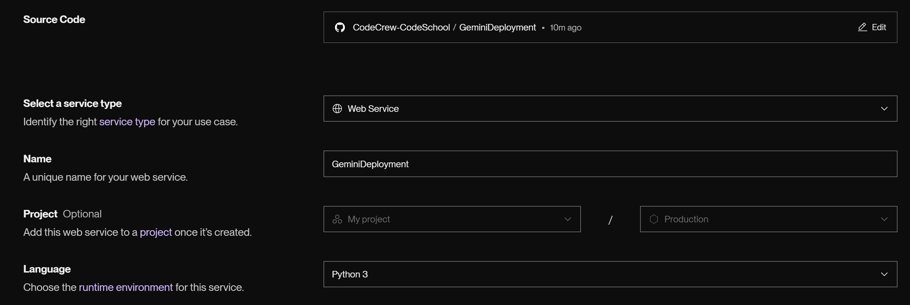
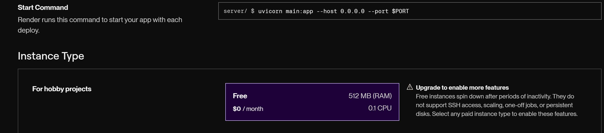
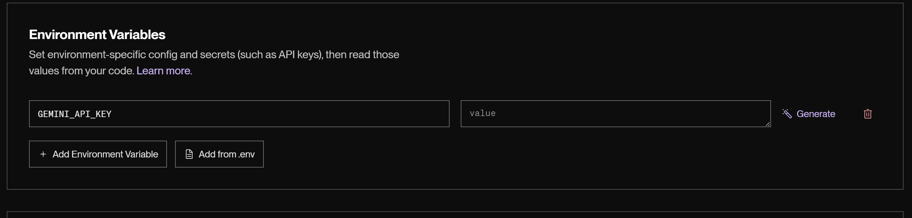
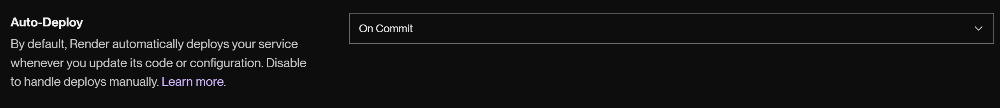
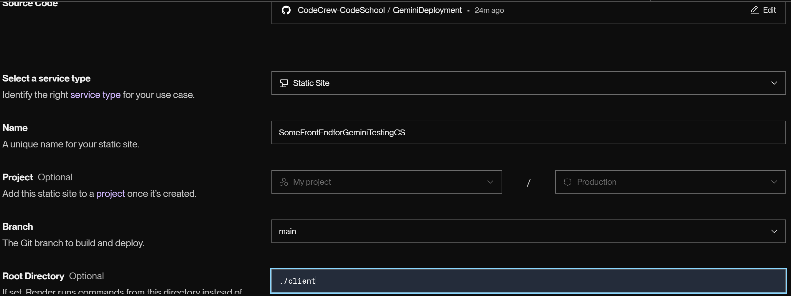
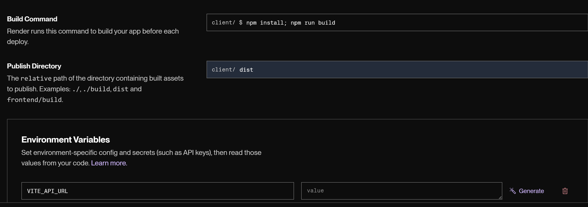

# GeminiDeployment
## Description
You will deploy an AI-Based Full Stack Web Application!!

## Objetives
1. Learn how to use **Google Cloud API Products**
2. Practice Essential **AI Engineering Skills**
3. Understand the **architecture of full stack web applications**
4. Deploy an **AI application** to the internet

## Running Locally
1. Server
```bash
cd server
python -m uvicorn main:app --reload --port 8000
```

2. Client
```bash
cd client
npm run dev
```
## Tasks
### Comment Tasks
1. Do in-line comments whenever there is a ``# COMMENT`` comment
2. Add some comments for client React Vite App

### Development Tasks
1. Create a [Google Cloud Project](https://console.cloud.google.com)
2. Create a [Google Gemini Key](https://aistudio.google.com/api-keys)
3. Create a ``.env`` file in the server folder with the following format
    ```bash
    GEMINI_API_KEY=
    ```
4. Set Up the Google Gemini Key in your enviromental variables
5. Select your Gemini Model (Check THE TODO COMMENT)
6. Create the AI-Prompt for your bot (Check THE TODO COMMENT)
7. Test you app with Thunderclient or Postman
8. Test your full stack app locally

### Deployment Tasks
1. Go to Render and Create an Account using your Github Account
2. Crate a Project
3. Create a Web Service based on your Repo Server





4. Create .env file at client with the following structure and paste the backend url
```bash
VITE_API_URL=
```
5. Create a Static Site App


6. Update CORS with your FrontEnd API


